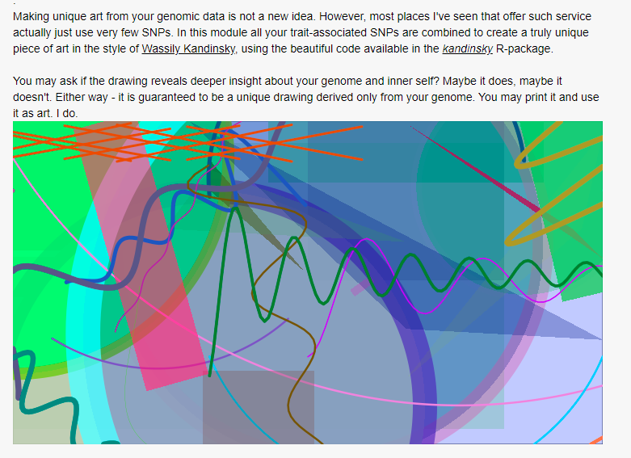
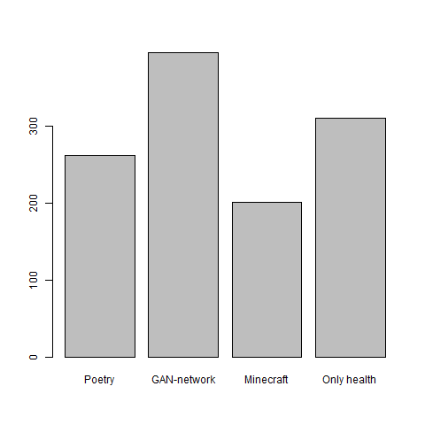

# Precision art

## Background

On the impute.me website one of the modules is named ["kandinskify yourself"](https://www.impute.me/kandinsky/). It has been running almost since the founding on the project in 2015 and is based on [this algorithm](http://giorasimchoni.com/2017/07/30/2017-07-30-data-paintings-the-kandinsky-package/). It's  purpose is to generate a simple artwork based on randomness - but with the checksum of the users DNA as random seed. In this way the art is unique to the user themselves and will be so even on re-running of the procecessing. It has been accessed by approximately 10k times of the users, which is ~25% of the total user base. A typical output looks like this:

Since 2019 an additional plugin have performed the same, but with written poetry based on [this algorithm](https://github.com/schollz/poetry-generator), such as this example.

>##From What Are Planetariums Promised  
>Realized dashing rose from palm tree leaf to harrowing wind,  
>hidden doors drawn by many channels, a  
>neurotic ripple begins to seize.  
>But I should be untrue to genetics, scratching among its inevitable methylation sites  
>so let us attempt to tell a story without pathway redundancies.  
>Waking toward the school and so that its cold fires will taunt you.  
>  
>An algorithm reading your genome, 2020-02-06

The technical implementation of both these is fairly simple and is only based on the property of DNA-information as a random seed. This can be improved. For this reason we launched a user survey in summer 2019 posing the following four choices

1. Focus on the written poetry: explore how the AI-generated poetry can be made even more relevant and personal, based on trait and ancestry predictions
2. Generating GAN-network-based art spanning from Rococo landscapes to modern art, then training user-impressions on genetics to provide incrementally better and better personalized precision-art
3. Generating downloadable Minecraft worlds based on your personal DNA, complete with walkable double helix tunnels, gene-annotations and warp-points for travelling to your favourite gene
4. Dont spend time on this, stick to health genetics!

The results of the survey is now available and came out in favour of option 2:

It is therefore of interest to expand on this into a module that will be called the  _precision art_ module.

## Suggested implementation

Within the scope of the task, the main criteria of success is to showcase modern image machine learning algorithms and how they can function with genetics. In other words - if it is interesting, it is appropriate. A little more detailed setup idea consist of two separate work packages. A work-package 1 which expands the scope of pictures generated using [GAN](https://en.wikipedia.org/wiki/Generative_adversarial_network)-approaches and a work-package 2 which trains the outputting generator based on genetic information and user-feedback such that it can generate images that are increasingly liked by people, as deducted from their DNA information.

For work-package 1, many interesting approaches are outlined online, e.g. [this](https://github.com/robbiebarrat/art-DCGAN), [this](https://towardsdatascience.com/image-generator-drawing-cartoons-with-generative-adversarial-networks-45e814ca9b6b) or [this](https://github.com/gsurma/image_generator/blob/master/ImageGeneratorDCGAN.ipynb). All have the capability to act as image-generators based on provided data sets. No doubt more are available. The key to create here is to figure out how to connect the generated image with genetic data. Presumably a checksum of DNA data could suffice, such that people with a given DNA code always get a unique image.

For work-package 2, the task involves setting up (in R/Shiny) a simple interface that can collect user-input given on each image as e.g. thumps up or thumbs down. With that in hand, as well as the complete set of derived DNA-calculations from impute.me, it should be possible to train the image-selector such that it can optimize the count of thumps up scores. If this is achieved the module will become the worlds first _precision art_ module. Within the scope of work-package 2, test data running is enough, leaving room...

For work-package 3: which simply is the real-life implementation in impute.me including collection of user feedback and continous automated improvement of image-selection algorithms.

